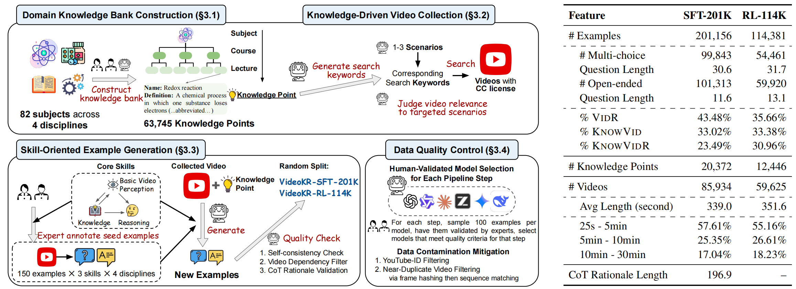

# VideoKR: Towards Knowledge- and Reasoning-Intensive Video Understanding

<p align="center">
    🤗 <a href="https://huggingface.co/collections/minuzero/videokr">Hugging Face</a>&nbsp&nbsp | &nbsp&nbsp📄 <a href="https://arxiv.org/abs/XXXX.XXXXX">arXiv</a>
</p>


## 📖 Abstract

VideoKR is the first large-scale training corpus designed for knowledge- and reasoning-intensive video understanding. It contains 315K video reasoning examples over 145K newly collected, CC-licensed expert-domain videos, built through a human-in-the-loop, skill-oriented generation pipeline that improves difficulty, diversity, and CoT rationale quality. We also introduce VideoKR-Eval, an expert-annotated benchmark requiring genuine video understanding rather than textual shortcuts; under a standard SFT -> GRPO pipeline, VideoKR post-training improves knowledge-intensive video reasoning while remaining competitive on general video reasoning.

<div align="center">

<p><em>Overview of the VideoKR.</em></p>
</div>

## 🔗 Resources

- Training data: [minuzero/VideoKR-Train](https://huggingface.co/datasets/minuzero/VideoKR-Train)
- Evaluation data: [minuzero/VideoKR-Eval](https://huggingface.co/datasets/minuzero/VideoKR-Eval)
- SFT checkpoints: [VideoKR-Qwen2.5-VL-7B-SFT](https://huggingface.co/minuzero/VideoKR-Qwen2.5-VL-7B-SFT), [VideoKR-Qwen3-VL-8B-SFT](https://huggingface.co/minuzero/VideoKR-Qwen3-VL-8B-SFT)
- GRPO checkpoints: [VideoKR-Qwen2.5-VL-7B](https://huggingface.co/minuzero/VideoKR-Qwen2.5-VL-7B), [VideoKR-Qwen3-VL-8B](https://huggingface.co/minuzero/VideoKR-Qwen3-VL-8B)

## 🚀 Quick Start

### Installation

```bash
git clone https://github.com/Fu-Fu-Fu-Fu/VideoKR.git
cd VideoKR
```

We recommend using separate conda environments for SFT, RL, and evaluation.

#### SFT Environment

```bash
cd /path/to/VideoKR/llamafactory
conda create -n videokr_train python=3.11 pip -y
conda activate videokr_train

pip install --upgrade pip setuptools wheel
pip install -e . -r requirements/deepspeed.txt
```

#### RL Environment

```bash
cd /path/to/VideoKR/verl
conda create -n videokr_verl python=3.11 -y
conda activate videokr_verl

pip install --upgrade pip setuptools wheel
pip install torch==2.8.0 torchvision==0.23.0 torchaudio==2.8.0 xformers==0.0.32.post1
pip install "vllm==0.11.0" "transformers==4.57.6" "ray[default]==2.55.1" "numpy==1.26.4"
pip install -e ".[vllm,gpu]" --no-build-isolation
pip install qwen-vl-utils rouge-score
```

#### Evaluation Environment

```bash
cd /path/to/VideoKR/lmms_eval
conda create -n videokr_eval python=3.11 -y
conda activate videokr_eval

pip install --upgrade pip setuptools wheel
pip install -e ".[vllm]"
```

## 🛠️ Training

### VideoKR-SFT Training

Prepare the supervised fine-tuning data:

```bash
cd /path/to/VideoKR/llamafactory
conda activate videokr_train

mkdir -p data/raw
huggingface-cli download minuzero/VideoKR-Train \
  --repo-type dataset \
  --local-dir data/raw \
  --include "VideoKR-COT-201K.jsonl"

python local_script/prepare_videokr_sft_data.py \
  --input data/raw/VideoKR-COT-201K.jsonl \
  --output data/videokr_train.json
```

Download and extract the corresponding videos following `llamafactory/README.md`, then launch SFT:

```bash
# Qwen2.5-VL
bash local_script/train_videokr.sh qwen2_5vl

# Qwen3-VL
bash local_script/train_videokr.sh qwen3vl
```

To train from local base model weights:

```bash
MODEL_NAME_OR_PATH=/path/to/Qwen3-VL-8B-Instruct \
OUTPUT_DIR=saves/videokr/qwen3vl_sft \
bash local_script/train_videokr.sh qwen3vl
```

### VideoKR-GRPO Training

Prepare the RLVR data:

```bash
cd /path/to/VideoKR/verl
conda activate videokr_verl

python local_script/prepare_videokr_rl_data.py \
  --dataset_name minuzero/VideoKR-Train \
  --data_file VideoKR-RL-114K.jsonl \
  --video_base_dir /path/to/VideoKR-Train \
  --output_dir data/videokr_rl
```

Run GRPO training:

```bash
MODEL_PATH=/path/to/VideoKR-SFT-checkpoint \
N_GPUS=8 \
bash local_script/train_videokr_grpo.sh
```

Merge a verl checkpoint into Hugging Face format:

```bash
bash local_script/merge_videokr_checkpoint.sh \
  outputs/videokr_grpo/videokr_qwen_vl/checkpoints/global_step_20/actor \
  outputs/videokr_grpo/videokr_qwen_vl/merged_hf
```

## 📈 Evaluation

Evaluate a merged Hugging Face checkpoint, or one of the released `minuzero/VideoKR-Qwen*-VL-*` checkpoints, on `videokr_eval` with vLLM:

```bash
cd /path/to/VideoKR/lmms_eval
conda activate videokr_eval

export CUDA_VISIBLE_DEVICES=0
export VIDEOKR_MODEL=/path/to/VideoKR-checkpoint
export TASKS=videokr_eval
export BATCH_SIZE=1
export RUN_NAME=videokr_eval

bash examples/models/videokr_vllm.sh
```

For a quick sanity check:

```bash
export LIMIT=10
bash examples/models/videokr_vllm.sh
```

If no API key is provided, the evaluator uses rule-based scoring for multiple-choice questions and skips open-ended questions. To enable a VLM judge for open-ended questions, set an OpenAI-compatible endpoint before running evaluation:

```bash
export API_TYPE=openai
export OPENAI_API_KEY=...
export OPENAI_BASE_URL=https://api.openai.com/v1
export MODEL_VERSION=gpt-4o

bash examples/models/videokr_vllm.sh
```

Results are saved under:

```text
lmms_eval/outputs/videokr/${RUN_NAME}_vllm/
```

## 🗂️ Repository Layout

- `llamafactory/`: supervised fine-tuning with LLaMA-Factory
- `verl/`: GRPO reinforcement learning with verl
- `lmms_eval/`: evaluation with lmms-eval and vLLM

## 🙏 Acknowledgements

This repository builds on the excellent [LLaMA-Factory](https://github.com/hiyouga/LLaMA-Factory), [verl](https://github.com/volcengine/verl), and [lmms-eval](https://github.com/EvolvingLMMs-Lab/lmms-eval) projects.

## 📝 Citation

If you find VideoKR useful in your research, please cite our paper:

```bibtex
@misc{fu2026videokrknowledgereasoningintensivevideo,
      title={VideoKR: Towards Knowledge- and Reasoning-Intensive Video Understanding}, 
      author={Lin Fu and Zheyuan Yang and Yang Wang and Tingyu Song and Arman Cohan and Yilun Zhao},
      year={2026},
      eprint={2606.05259},
      archivePrefix={arXiv},
      primaryClass={cs.CV},
      url={https://arxiv.org/abs/2606.05259}, 
}
```
